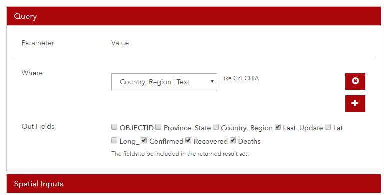

# Covid counter
Covid counter display actual information about confirmed, recovered and deaths in local area

## About
I used NodeMCU with ESP8266 and wifi module.

For online data I used API from [arcgis](https://coronavirus-disasterresponse.hub.arcgis.com/datasets/bbb2e4f589ba40d692fab712ae37b9ac_1). In my case, I choose the following settings unde API Explorer:

- At “Where” you choose “Country_Region” and then, for example, enter “CZECHIA”.
- Under “From fields”, check “Last_Update”, “Confirmed”, “Deaths”, “Recovered” and the rest off.
- At “Output options” you set “Request geometry” to “False”.

For parsing json data received back I used online [ArduinoJson Assistant](https://arduinojson.org/v6/assistant/).

## Libraries
You will need following libraries
- [TM1637Display](https://github.com/avishorp/TM1637)
- [ESP8266WiFiMulti](https://github.com/esp8266/Arduino)
- [ESP8266HTTPClient](https://github.com/esp8266/Arduino)
- [ArduinoJson](https://arduinojson.org)
